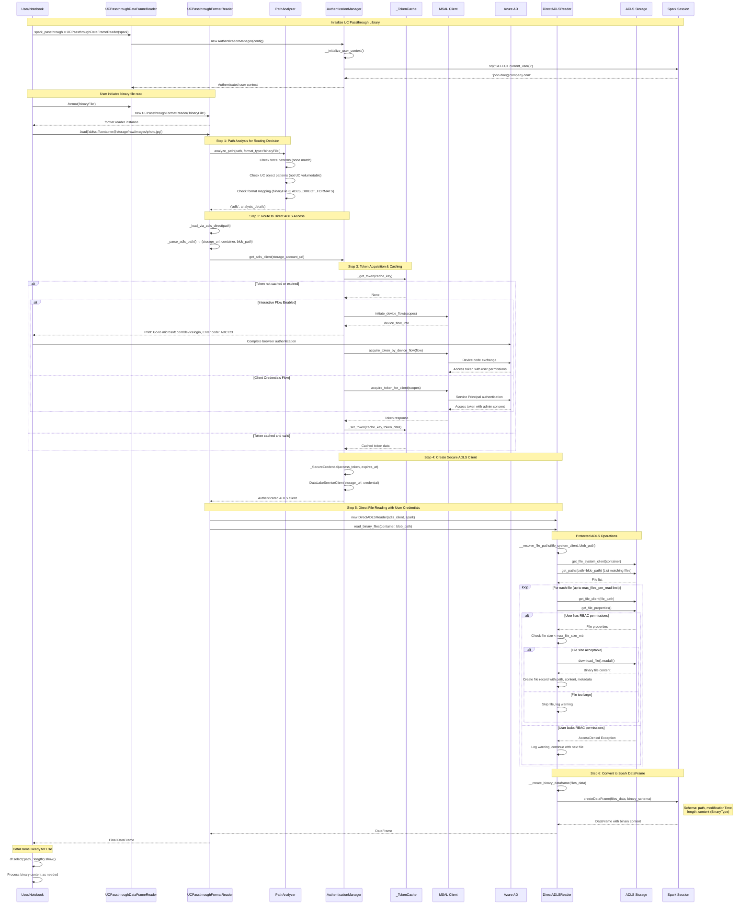

```mermaid
sequenceDiagram
    participant User as User/Notebook
    participant Reader as UCPassthroughDataFrameReader
    participant FormatReader as UCPassthroughFormatReader
    participant PathAnalyzer as PathAnalyzer
    participant AuthManager as AuthenticationManager
    participant TokenCache as _TokenCache
    participant MSAL as MSAL Client
    participant AzureAD as Azure AD
    participant DirectReader as DirectADLSReader
    participant ADLS as ADLS Storage
    participant Spark as Spark Session

    Note over User, Spark: Initialize UC Passthrough Library
    User ->> Reader: spark_passthrough = UCPassthroughDataFrameReader(spark)
    Reader ->> AuthManager: new AuthenticationManager(config)
    AuthManager ->> AuthManager: __initialize_user_context()
    AuthManager ->> Spark: sql("SELECT current_user()")
    Spark -->> AuthManager: 'john.doe@company.com'
    AuthManager -->> Reader: Authenticated user context

    Note over User, FormatReader: User initiates binary file read
    User ->> Reader: .format('binaryFile')
    Reader ->> FormatReader: new UCPassthroughFormatReader('binaryFile')
    FormatReader -->> User: format reader instance
    
    User ->> FormatReader: .load('abfss://container@storage/raw/images/photo.jpg')

    Note over FormatReader, PathAnalyzer: Step 1: Path Analysis for Routing Decision
    FormatReader ->> PathAnalyzer: analyze_path(path, format_type='binaryFile')
    PathAnalyzer ->> PathAnalyzer: Check force patterns (none match)
    PathAnalyzer ->> PathAnalyzer: Check UC object patterns (not UC volume/table)
    PathAnalyzer ->> PathAnalyzer: Check format mapping (binaryFile ∈ ADLS_DIRECT_FORMATS)
    PathAnalyzer -->> FormatReader: ('adls', analysis_details)

    Note over FormatReader, AuthManager: Step 2: Route to Direct ADLS Access
    FormatReader ->> FormatReader: _load_via_adls_direct(path)
    FormatReader ->> FormatReader: _parse_adls_path() → (storage_url, container, blob_path)
    
    FormatReader ->> AuthManager: get_adls_client(storage_account_url)

    Note over AuthManager, TokenCache: Step 3: Token Acquisition & Caching
    AuthManager ->> TokenCache: _get_token(cache_key)
    
    alt Token not cached or expired
        TokenCache -->> AuthManager: None
        
        alt Interactive Flow Enabled
            AuthManager ->> MSAL: initiate_device_flow(scopes)
            MSAL -->> AuthManager: device_flow_info
            AuthManager -->> User: Print: Go to microsoft.com/devicelogin, Enter code: ABC123
            User ->> AzureAD: Complete browser authentication
            AuthManager ->> MSAL: acquire_token_by_device_flow(flow)
            MSAL ->> AzureAD: Device code exchange
            AzureAD -->> MSAL: Access token with user permissions
        else Client Credentials Flow
            AuthManager ->> MSAL: acquire_token_for_client(scopes)
            MSAL ->> AzureAD: Service Principal authentication
            AzureAD -->> MSAL: Access token with admin consent
        end
        
        MSAL -->> AuthManager: Token response
        AuthManager ->> TokenCache: _set_token(cache_key, token_data)
        
    else Token cached and valid
        TokenCache -->> AuthManager: Cached token data
    end

    Note over AuthManager, DirectReader: Step 4: Create Secure ADLS Client
    AuthManager ->> AuthManager: _SecureCredential(access_token, expires_at)
    AuthManager ->> AuthManager: DataLakeServiceClient(storage_url, credential)
    AuthManager -->> FormatReader: Authenticated ADLS client

    Note over FormatReader, DirectReader: Step 5: Direct File Reading with User Credentials
    FormatReader ->> DirectReader: new DirectADLSReader(adls_client, spark)
    FormatReader ->> DirectReader: read_binary_files(container, blob_path)
    
    Note over DirectReader, ADLS: Protected ADLS Operations
    DirectReader ->> DirectReader: __resolve_file_paths(file_system_client, blob_path)
    DirectReader ->> ADLS: get_file_system_client(container)
    DirectReader ->> ADLS: get_paths(path=blob_path) [List matching files]
    ADLS -->> DirectReader: File list
    
    loop For each file (up to max_files_per_read limit)
        DirectReader ->> ADLS: get_file_client(file_path)
        DirectReader ->> ADLS: get_file_properties()
        
        alt User has RBAC permissions
            ADLS -->> DirectReader: File properties
            DirectReader ->> DirectReader: Check file size < max_file_size_mb
            
            alt File size acceptable
                DirectReader ->> ADLS: download_file().readall()
                ADLS -->> DirectReader: Binary file content
                DirectReader ->> DirectReader: Create file record with path, content, metadata
            else File too large
                DirectReader ->> DirectReader: Skip file, log warning
            end
            
        else User lacks RBAC permissions
            ADLS -->> DirectReader: AccessDenied Exception
            DirectReader ->> DirectReader: Log warning, continue with next file
        end
    end

    Note over DirectReader, Spark: Step 6: Convert to Spark DataFrame
    DirectReader ->> DirectReader: __create_binary_dataframe(files_data)
    DirectReader ->> Spark: createDataFrame(files_data, binary_schema)
    Note right of Spark: Schema: path, modificationTime,<br/>length, content (BinaryType)
    
    Spark -->> DirectReader: DataFrame with binary content
    DirectReader -->> FormatReader: DataFrame
    FormatReader -->> User: Final DataFrame
    Note over User: DataFrame Ready for Use
    User ->> User: df.select('path', 'length').show()
    User ->> User: Process binary content as needed
```
